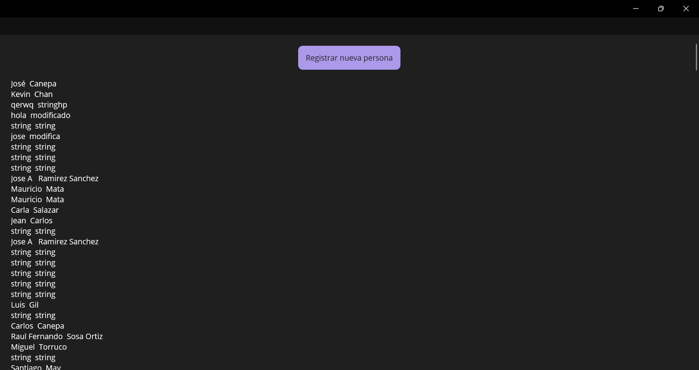
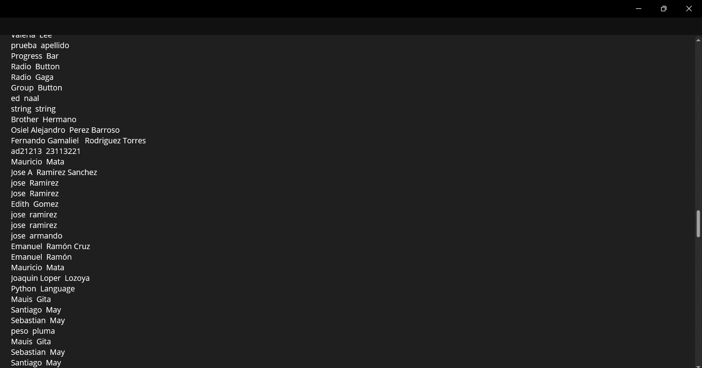
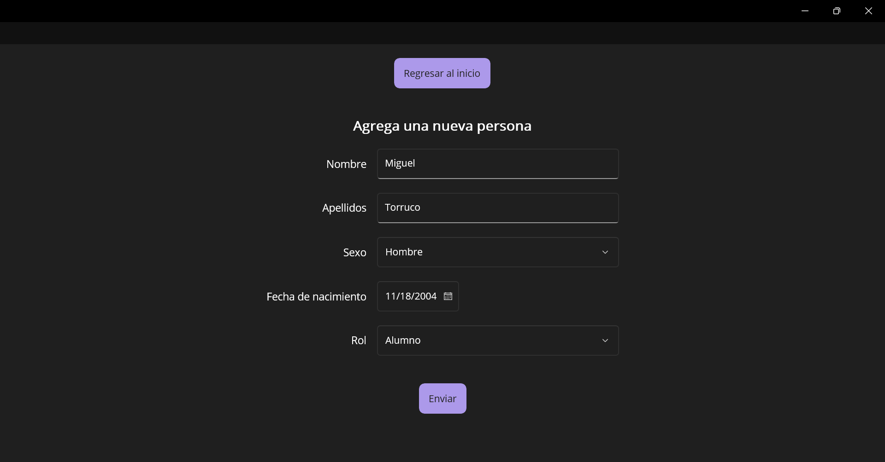
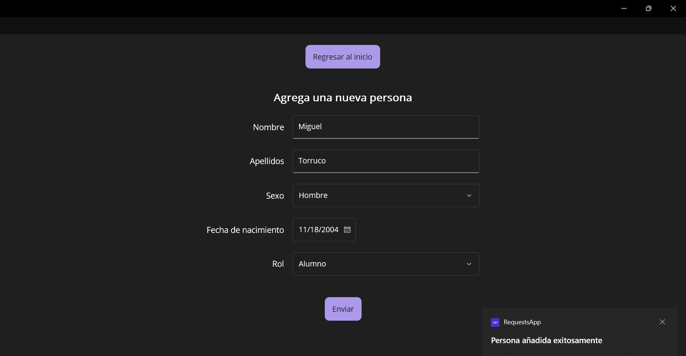
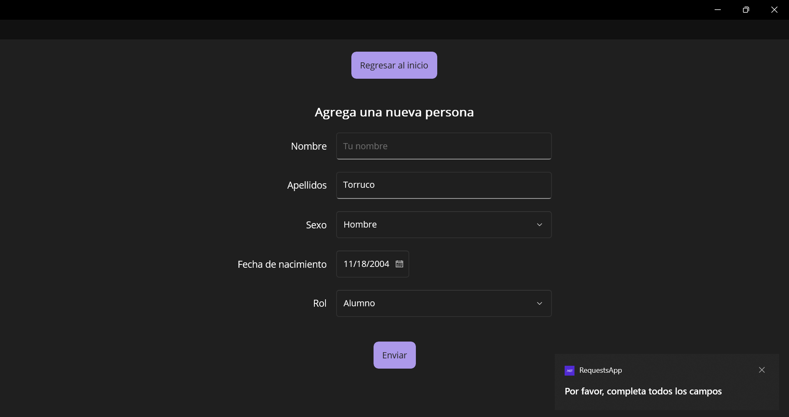

# Proyecto de .NET MAUI

## Descripción
Esta es una aplicación hecha con el framework .NET MAUI, creada para practicar el concepto de Data Binding y el consumo de APIs desde C#. 

## Funcionalidades
El endpoint que se consume es el siguiente: https://fi.jcaguilar.dev/v1/escuela/persona

La aplicación se compone de 2 vistas, las cuales te permiten realizar las siguientes operaciones:

- Traer todos los datos desde un endpoint de una API y mostrarlos en una lista, en la vista principal. 
- Registrar a una nueva persona en un formulario y enviar los datos a la API para que se guarden en la base de datos. 

Existen botones para navegar entre esas dos vistas, así como hay detecciones de errores implementada. 

## Capturas de pantalla 

### Vista principal

### Formulario

